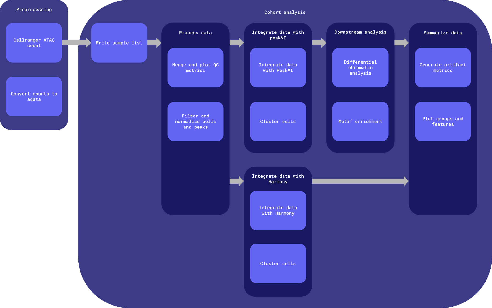

# sc-atacseq-wf

Repo for testing and developing a common postmortem-derived brain sequencing (PMDBS) workflow harmonized across ASAP with single cell ATAC sequencing data.

Common workflows, tasks, utility scripts, and docker images reused across harmonized ASAP workflows are defined in [the wf-common repository](https://github.com/ASAP-CRN/wf-common).


# Table of contents

- [Workflows](#workflows)
- [Inputs](#inputs)
- [Outputs](#outputs)
    - [Output structure](#output-structure)
- [Docker images](#docker-images)


# Workflows

Worfklows are defined in [the `workflows` directory](workflows). The python scripts which process the data at each stage can be found [the docker/sc_atac_tools/scripts directory](docker/sc_atac_tools/scripts) and [the docker/scvi_tools/scripts directory](docker/scvi_tools/scripts).



**Entrypoint**: [workflows/main.wdl](workflows/main.wdl)

**Input template**: [workflows/inputs.json](workflows/inputs.json)

The workflow is broken up into two main chunks:

1. [Preprocessing](#preprocessing)
2. [Cohort analysis](#cohort-analysis)

> Note: The details of the cohort analysis are described in the [docker dir README](docker/README.md).

## Preprocessing

Run once per pool; only rerun when the preprocessing workflow version is updated. Preprocessing outputs are stored in the originating team's raw and staging data buckets.

## Cohort analysis

Run once per team (all samples from a single team) if `project.run_project_cohort_analysis` is set to `true`, and once for the whole cohort (all samples from all teams). This can be rerun using different sample subsets; including additional samples requires this entire analysis to be rerun. Intermediate files from previous runs are not reused and are stored in timestamped directories.

# Inputs

An input template file can be found at [workflows/inputs.json](workflows/inputs.json).

| Type | Name | Description |
| :- | :- | :- |
| String | cohort_id | Name of the cohort; used to name output files during cross-team cohort analysis. |
| Array[[Project](#project)] | projects | The project ID, set of samples and their associated reads and metadata, output bucket locations, and whether or not to run project-level cohort analysis. |
| File | cellranger_atac_reference_data | Cell Ranger ATAC reference data; see https://www.10xgenomics.com/support/software/cell-ranger-atac/downloads#reference-downloads. |
| File | cellranger_atac_reference_chrom_sizes | Chromosome sizes file (.chrom.sizes or .fa.fai) from the Cell Ranger ATAC reference, used to validate fragment coordinates during splitting; see [demultiplexing section](#demultiplexing). |
| Array[File] | vireo_assignment_csv | Vireo donor assignment CSVs with columns: donor_id, sample, raw_bc. Covers all donors in the pool. |
| File? | allen_brain_mmc_precomputed_stats_h5 | A precomputed statistics file from the Allen Brain Cell Atlas containing reference statistics (the average gene expression profile per cell type cluster and cell type taxonomy). |
| Int? | n_top_genes | Number of HVG genes to keep. [3000] |
| Int? | n_comps | Number of principal components to compute. [30] |
| String? | batch_key | Key in AnnData object for batch information. ['batch_id'] |
| String? | peakvi_latent_key | Latent key to save the PeakVI latent to. ['X_peakVI'] |
| Int? | peakvi_max_epochs | The maximum number of full passes through the training data during PeakVI model training. If the model converges early, training will halt before this limit is reached. [300] |
| Array[String]? | groups | Groups to produce umap plots for. ['sample', 'batch', 'team', 'dataset', 'batch_id', 'leiden'] |
| Array[String]? | features | Features to produce umap plots for. ['n_fragment', 'tsse', 'frac_dup', 'frac_mito', 'doublet_score', 'doublet_probability'] |
| Boolean? | run_cross_team_cohort_analysis | Whether to run downstream harmonization steps on all samples across projects. If set to false, only preprocessing steps (cellranger and generating the initial adata object(s)) will run for samples. [false] |
| String | cohort_raw_data_bucket | Bucket to upload cross-team cohort intermediate files to. |
| Array[String] | cohort_staging_data_buckets | Buckets to upload cross-team cohort analysis outputs to. |
| String | container_registry | Container registry where workflow Docker images are hosted. |
| String? | zones | GCP zones where compute will take place. ['us-central1-c us-central1-f'] |

## Structs

### Project

| Type | Name | Description |
| :- | :- | :- |
| String | asap_team_id | ASAP-generated unique identifier for team; used for naming output files. |
| String | asap_dataset_id | ASAP-generated unique identifier for dataset; used for metadata. |
| String | asap_dataset_doi_url | ASAP-generated Zenodo DOI URL referencing the dataset. |
| Array[[Pool](#pool)] | pools | The set of pools (multiplexed data) associated with this project. |
| Boolean | run_project_cohort_analysis | Whether or not to run cohort analysis within the project. |
| String | raw_data_bucket | Raw data bucket; intermediate output files that are not final workflow outputs are stored here. |
| String | staging_data_bucket | Staging data bucket; final project-level outputs are stored here. |

### Pool

| Type | Name | Description |
| :- | :- | :- |
| String | asap_pool_id | ASAP-generated unique identifier for pool; used for naming output files. |
| File | fastq_R1 | Path to the pooled samples' read 1 FASTQ file. |
| File | fastq_R2 | Path to the pooled samples' read 2 FASTQ file. |
| File | fastq_R3 | Path to the pooled samples' 3 FASTQ file. |
| File? | fastq_I1 | Optional fastq index 1. |
| File? | fastq_I2 | Optional fastq index 2. |
| Array[[Sample](#sample)] | samples | The set of samples associated with this project. |
| Boolean | multimodal_data | Whether or not the sc/sn ATAC-seq is from multimodal data. |

### Sample

| Type | Name | Description |
| :- | :- | :- |
| String | asap_subject_id | ASAP-generated unique identifier for subject/donor; used for metadata. |
| String | sample_id | ASAP-generated unique identifier combined with the replicate for the sample within the project. |
| String? | batch | The sample's batch. |

## Generating the inputs JSON

The inputs JSON may be generated manually, however when running a large number of samples, this can become unwieldly. The [`generate_inputs` utility script](https://github.com/ASAP-CRN/wf-common/blob/main/util/generate_inputs) may be used to automatically generate the inputs JSON (`inputs.{staging_env}.{cohort_dataset_id}.{date}.json`) and a sample list TSV (`{team_id}.{cohort_dataset_id}.sample_list.{date}.tsv`); same as the one generated in [the write_cohort_sample_list task](https://github.com/ASAP-CRN/wf-common/wdl/tasks/write_cohort_sample_list.wdl)). The script requires the libraries outlined in [the requirements.txt file](https://github.com/ASAP-CRN/wf-common/util/requirements.txt) and the following inputs:

- `project-tsv`: One or more project TSVs with one row per sample and columns team_id, ASAP_dataset_id, ASAP_sample_id, batch, fastq_R1s, fastq_R2s, fastq_R3s, fastq_I1s, fastq_I2s, embargoed, source, modality_flavour, dataset_DOI_url, and SPATIAL columns if applicable: geomx_config, geomx_dsp_config, geomx_annotation_file, visium_cytassist, visium_probe_set, visium_slide_ref, and visium_capture_area. All samples from all projects may be included in the same project TSV, or multiple project TSVs may be provided.
    - `team_id`: A unique identifier for the team from which the sample(s) arose.
    - `ASAP_dataset_id`: A generated unique identifier for the dataset from which the sample(s) arose.
    - `pool_id`: Source identifier for the pool within the project.
    - `source_subject_id`: Source identifier for the subject within the pool/project.
    - `ASAP_subject_id`: A generated unique identifier for the subject within the pool/project.
    - `ASAP_sample_id`: A generated unique identifier for the sample within the pool/project.
    - `batch`: The sample's batch.
    - `fastq_R1s`: The gs uri to read 1 of sample FASTQ.
        - This is appended to the `project-tsv` from the `fastq-locs-txt`: FASTQ locations for all samples provided in the `project-tsv`. Each sample is expected to have one set of paired fastqs located at `${fastq_path}/${sample_id}*`. The read 1 file should include 'R1' somewhere in the filename. Generate this file e.g. by running `gcloud storage ls gs://fastq_bucket/some/path/**.fastq.gz >> fastq_locs.txt`.
    - `fastq_R2s`: The gs uri to read 2 of sample FASTQ.
        - This is appended to the `project-tsv` from the `fastq-locs-txt`: FASTQ locations for all samples provided in the `project-tsv`. Each sample is expected to have one set of paired fastqs located at `${fastq_path}/${sample_id}*`. The read 2 file should include 'R2' somewhere in the filename. Generate this file e.g. by running `gcloud storage ls gs://fastq_bucket/some/path/**.fastq.gz >> fastq_locs.txt`.
    - `fastq_R3s`: The gs uri to read 3 of sample FASTQ.
        - This is appended to the `project-tsv` from the `fastq-locs-txt`: FASTQ locations for all samples provided in the `project-tsv`. Each sample is expected to have one set of paired fastqs located at `${fastq_path}/${sample_id}*`. The read 3 file should include 'R3' somewhere in the filename. Generate this file e.g. by running `gcloud storage ls gs://fastq_bucket/some/path/**.fastq.gz >> fastq_locs.txt`.
    - `fastq_I1s`: The gs uri to sample FASTQ index 1.
    - `fastq_I2s`: The gs uri to sample FASTQ index 2.
    - `embargoed`: The internal QC/embargo status of dataset.
    - `source`: The source of dataset (e.g. 'pmdbs').
    - `modality_flavour`: The data modality flavour of dataset (e.g. 'sn-atacseq')
    - `dataset_DOI_url`: Generated Zenodo DOI URL referencing the dataset.
- `inputs-template`: The inputs template JSON file into which the `projects` information derived from the `project-tsv` will be inserted. Must have a key ending in `*.projects`. Other default values filled out in the inputs template will be written to the output inputs.json file.
- `run-project-cohort-analysis`: Optionally run project-level cohort analysis for provided projects. This value will apply to all projects. [false]
- `workflow_name`: WDL workflow name.
- `cohort-dataset-id`: Dataset name in cohort bucket id (e.g. 'cohort-pmdbs-sc-atacseq').

Example usage:

```bash
./wf-common/util/generate_inputs \
    --project-tsv metadata.tsv \
    --inputs-template workflows/inputs.json \
    --run-project-cohort-analysis \
    --workflow-name sc_atacseq_analysis \
    --release-version v5.0.0 \
    --cohort-dataset-id cohort-pmdbs-sc-atacseq
```

# Outputs

## Output structure

- `cohort_id`: either the `team_id` for project-level cohort analysis, or the `cohort_id` for the full cohort
- `workflow_run_timestamp`: format: `%Y-%m-%dT%H-%M-%SZ`
- The list of samples used to generate the cohort analysis will be output alongside other cohort analysis outputs in the staging data bucket (`${cohort_id}.sample_list.tsv`)
- The `MANIFEST.tsv` file in the staging data bucket describes the file name, md5 hash, timestamp, workflow version, workflow name, and workflow release for the run used to generate each file in that directory

### Raw data (intermediate files and final outputs for all runs of the workflow)

The raw data bucket will contain *some* artifacts generated as part of workflow execution. Following successful workflow execution, the artifacts will also be copied into the staging bucket as final outputs.

In the workflow, task outputs are either specified as `String` (final outputs, which will be copied in order to live in raw data buckets and staging buckets) or `File` (intermediate outputs that are periodically cleaned up, which will live in the cromwell-output bucket). This was implemented to reduce storage costs.

```bash
asap-raw-{cohort,team-xxyy}-{source}-{modality_flavour}-{context}
└── workflow_execution
    └── pmdbs_sc_atacseq
        ├── cohort_analysis
        │   └──${cohort_analysis_workflow_version}
        │       └── ${workflow_run_timestamp}
        │            └── <cohort outputs>
        └── preprocess  // only produced in project raw data buckets, not in the full cohort bucket
            ├── cellranger_atac
            │   └── ${cellranger_atac_task_version}
            │       └── <cellranger_atac output>
            ├── split_demux_fragments
            │   └── ${split_fragments_task_version}
            │       └── <split_demux_fragments output>
            └── counts_to_adata
                └── ${adata_task_version}
                    └── <counts_to_adata output>
```

### Staging data (intermediate workflow objects and final workflow outputs for the latest run of the workflow)

Following QC by researchers, the objects in the dev or uat bucket are synced into the curated data buckets, maintaining the same file structure. Curated data buckets are named `asap-curated-{cohort,team-xxyy}-{source}-{modality_flavour}-{context}` and `dataset_id` = `{cohort,team-xxyy}-{source}-{modality_flavour}-{context}`.

Data may be synced using [the `promote_staging_data` script](#promoting-staging-data).

```bash
asap-dev-{cohort,team-xxyy}-{source}-{modality_flavour}-{context}
└── pmdbs_sc_atacseq
    └── release
        └── ${crn_release_version}
            ├── cohort_analysis
            │   ├── ${cohort_id}.sample_list.tsv
            │   ├── ${cohort_id}.merged_filtered.h5ad
            │   ├── ${cohort_id}.initial_metadata.csv
            │   ├── ${cohort_id}.frag_size_distr.png
            │   ├── ${cohort_id}.tsse.png
            │   ├── ${cohort_id}.harmony_umap.png
            │   ├── ${cohort_id}.peakvi_model.tar.gz
            │   ├── ${cohort_id}.peakvi_umap.png
            │   ├── ${cohort_id}.harmony.leiden.merged_peaks.h5ad
            │   ├── ${cohort_id}.harmony.leiden.merged_peaks.csv
            │   ├── ${cohort_id}.harmony.leiden.peaks_matrix.h5ad
            │   ├── ${cohort_id}.peakvi.leiden.merged_peaks.h5ad
            │   ├── ${cohort_id}.peakvi.leiden.merged_peaks.csv
            │   ├── ${cohort_id}.peakvi.leiden.peaks_matrix.h5ad
            │   ├── ${cohort_id}.scib_report.csv
            │   ├── ${cohort_id}.scib_results.svg
            │   ├── ${cohort_id}.all_genes.csv
            │   ├── ${cohort_id}.hvg_genes.csv
            │   ├── ${cohort_id}.gene_matrix.magic_imputed.h5ad
            │   ├── ${cohort_id}.{mmc_otf_mapping.SEAAD}.extended_results.json
            │   ├── ${cohort_id}.{mmc_otf_mapping.SEAAD}.results.csv
            │   ├── ${cohort_id}.{mmc_otf_mapping.SEAAD}.log.txt
            │   ├── ${cohort_id}.mmc_results.parquet
            │   ├── ${cohort_id}.peakvi.cell_type.merged_peaks.h5ad
            │   ├── ${cohort_id}.peakvi.cell_type.merged_peaks.csv
            │   ├── ${cohort_id}.peakvi.cell_type.peaks_matrix.h5ad
            │   ├── ${cohort_id}.motifs.parquet
            │   ├── ${cohort_id}.features.umap.png
            │   ├── ${cohort_id}.groups.umap.png
            │   ├── ${cohort_id}.final.h5ad
            │   ├── ${cohort_id}.final_metadata.csv
            │   └── MANIFEST.tsv
            ├── preprocess
            │   ├── ${poolA_id}.cellranger_atac_outputs.tar.gz
            │   ├── ${poolA_id}.singlecell.csv
            │   ├── ${poolA_id}.peaks.bed
            │   ├── ${poolA_id}.cut_sites.bigwig
            │   ├── ${poolA_id}.raw_peak_bc_matrix.h5
            │   ├── ${poolA_id}.filtered_peak_bc_matrix.h5
            │   ├── ${poolA_id}.filtered_tf_bc_matrix.h5
            │   ├── ${poolA_id}.fragments.tsv.gz
            │   ├── ${poolA_id}.summary.csv
            │   ├── ${poolA_id}.peak_annotation.tsv
            │   ├── ${poolA_id}.peak_motif_mapping.bed
            │   ├── ${sampleA_id}.fragments.tsv.gz
            │   ├── ${sampleA_id}.cleaned_unfiltered.h5ad
            │   ├── ${poolB_id}.cellranger_atac_outputs.tar.gz
            │   ├── ${poolB_id}.singlecell.csv
            │   ├── ${poolB_id}.peaks.bed
            │   ├── ${poolB_id}.cut_sites.bigwig
            │   ├── ${poolB_id}.raw_peak_bc_matrix.h5
            │   ├── ${poolB_id}.filtered_peak_bc_matrix.h5
            │   ├── ${poolB_id}.filtered_tf_bc_matrix.h5
            │   ├── ${poolB_id}.fragments.tsv.gz
            │   ├── ${poolB_id}.summary.csv
            │   ├── ${poolB_id}.peak_annotation.tsv
            │   ├── ${poolB_id}.peak_motif_mapping.bed
            │   ├── ${sampleB_id}.fragments.tsv.gz
            │   ├── ${sampleB_id}.cleaned_unfiltered.h5ad
            │   ├── ...
            │   ├── ${poolN_id}.cellranger_atac_outputs.tar.gz
            │   ├── ${poolN_id}.singlecell.csv
            │   ├── ${poolN_id}.peaks.bed
            │   ├── ${poolN_id}.cut_sites.bigwig
            │   ├── ${poolN_id}.raw_peak_bc_matrix.h5
            │   ├── ${poolN_id}.filtered_peak_bc_matrix.h5
            │   ├── ${poolN_id}.filtered_tf_bc_matrix.h5
            │   ├── ${poolN_id}.fragments.tsv.gz
            │   ├── ${poolN_id}.summary.csv
            │   ├── ${poolN_id}.peak_annotation.tsv
            │   ├── ${poolN_id}.peak_motif_mapping.bed
            │   ├── ${sampleN_id}.fragments.tsv.gz
            │   ├── ${sampleN_id}.cleaned_unfiltered.h5ad
            │   └── MANIFEST.tsv
            ├── workflow_version # plain text file
            └── workflow_metadata
                └── ${timestamp}
                    ├── MANIFEST.tsv # combined
                    └── data_promotion_report.md
```

## Promoting staging data

The [`promote_staging_data` script](https://github.com/ASAP-CRN/wf-common/blob/main/util/promote_staging_data) can be used to promote staging data that has been approved to the curated data bucket for a team or set of teams.

This script compiles bucket and file information for both the initial (staging) and target (prod) environment. It also runs data integrity tests to ensure staging data can be promoted and generates a Markdown report. It (1) checks that files are not empty and are not less than or equal to 10 bytes (factoring in white space) and (2) checks that files have associated metadata and is present in MANIFEST.tsv.

If data integrity tests pass, this script will upload a combined MANIFEST.tsv and the data promotion Markdown report under a metadata/{timestamp} directory in the staging bucket. Previous manifest files and reports will be kept. Next, it will rsync all files in the staging bucket to the curated bucket's workflow and metadata directories. **Exercise caution when using this script**; files that are not present in the source (staging) bucket will be deleted at the destination (curated) bucket.

If data integrity tests fail, staging data cannot be promoted. The combined `MANIFEST.tsv`, Markdown report, and `promote_staging_data_script.log` will be locally available.

The script defaults to a dry run, printing out the files that would be copied or deleted for each selected team.

### Options

```
-h  Display this message and exit
-l  List available teams
-w  Workflow name used as a directory in bucket (e.g. 'pmdbs_sc_atacseq')
-v  Release version (e.g. v5.0.0)
-p  Promote data. If this option is not selected, data that would be copied or deleted is printed out, but files are not actually changed (dry run)
```

### Usage

```bash
# List available teams
./wf-common/util/promote_staging_data -l -w pmdbs_atac_rnaseq -v v5.0.0

# Print out the files that would be copied or deleted from the staging bucket to the curated bucket for teams' datasets processed through the sc ATAC-seq pipeline for a specific release version
./wf-common/util/promote_staging_data -w pmdbs_atac_rnaseq -v v5.0.0

# Promote data for teams' datasets processed through the sc ATAC-seq pipeline for a specific release version
./wf-common/util/promote_staging_data -w pmdbs_atac_rnaseq -v v5.0.0 -p
```

# Docker images

Docker images are defined in [the `docker` directory](docker). Each image must minimally define a `build.env` file and a `Dockerfile`.

Example directory structure:
```bash
docker
├── sc_atac_tools
│   ├── build.env
│   ├── Dockerfile
│   ├── requirements.txt
│   └── scripts
│       └── ...
├── scvi_tools
│   ├── build.env
│   ├── Dockerfile
│   ├── requirements.txt
│   └── scripts
│       └── ...
└── cellranger_atac
    ├── build.env
    ├── Dockerfile
    └── scripts
        └── ...
```

## The `build.env` file

Each target image is defined using the `build.env` file, which is used to specify the name and version tag for the corresponding Docker image. It must contain at minimum the following variables:

- `IMAGE_NAME`
- `IMAGE_TAG`

All variables defined in the `build.env` file will be made available as build arguments during Docker image build.

The `DOCKERFILE` variable may be used to specify the path to a Dockerfile if that file is not found alongside the `build.env` file, for example when multiple images use the same base Dockerfile definition.

## Building Docker images

Docker images can be build using the [`build_docker_images`](https://github.com/DNAstack/bioinformatics-scripts/blob/main/scripts/build_docker_images) script.

```bash
# Build a single image
./build_docker_images -d docker/sc_atac_tools

# Build all images in the `docker` directory
./build_docker_images -d docker

# Build and push all images in the docker directory, using the `dnastack` container registry
./build_docker_images -d docker -c dnastack -p
```

## Tool and library versions

| Image | Major tool versions | Links |
| :- | :- | :- |
| cellranger_atac | <ul><li>[cellranger-atac v2.2.0](https://www.10xgenomics.com/support/software/cell-ranger-atac/latest/release-notes/release-notes#2025-April)</li><li>[google-cloud-cli 524.0.0](https://cloud.google.com/sdk/docs/release-notes#52400_2025-05-28)</li></ul> | [Dockerfile](https://github.com/ASAP-CRN/sc-atacseq-wf/tree/main/docker/cellranger_atac) |
| scatac_fragment_tools | <ul><li>[scatac_fragment_tools v0.1.5](https://github.com/aertslab/scatac_fragment_tools/releases/tag/0.1.5)</li><li>[google-cloud-cli 524.0.0](https://cloud.google.com/sdk/docs/release-notes#52400_2025-05-28)</li></ul> | [Dockerfile](https://github.com/ASAP-CRN/sc-atacseq-wf/tree/main/docker/scatac_fragment_tools) |
| sc_atac_tools | <ul><li>[google-cloud-cli 524.0.0](https://cloud.google.com/sdk/docs/release-notes#52400_2025-05-28)</li><li>[python 3.10.12](https://www.python.org/downloads/release/python-31012/)</li></ul> Python libraries: <ul><li>argparse 1.4.0</li><li>[snapatac2 2.8.0](https://github.com/kaizhang/SnapATAC2/releases/tag/v2.8.0)</li><li>[scanpy 1.11.3](https://scanpy.readthedocs.io/en/stable/release-notes/index.html#v1-11-3)</li><li>[harmonypy 0.2.0](https://github.com/slowkow/harmonypy/releases/tag/v0.2.0)</li><li>[magic-impute 3.0.0](https://github.com/KrishnaswamyLab/MAGIC/releases/tag/v3.0.0)</li><li>kaleido 0.2.1</li><li>ipython 8.38.0</li></ul> | [Dockerfile](https://github.com/ASAP-CRN/sc-atacseq-wf/tree/main/docker/sc_atac_tools) |
| scvi_tools | <ul><li>[google-cloud-cli 524.0.0](https://cloud.google.com/sdk/docs/release-notes#52400_2025-05-28)</li><li>[python 3.10.12](https://www.python.org/downloads/release/python-31012/)</li><li>[cuda 12.8.1](https://developer.nvidia.com/cuda-12-8-1-download-archive)</li></ul> Python libraries: <ul><li>argparse 1.4.0</li><li>[scvi-tools 1.4.1](https://github.com/scverse/scvi-tools/releases/tag/1.4.1)</li><li>[torch 2.10.0](https://github.com/pytorch/pytorch/releases/tag/v2.10.0)</li><li>[jax 0.9.0](https://github.com/jax-ml/jax/releases/tag/jax-v0.9.0)</li><li>[scanpy 1.11.3](https://scanpy.readthedocs.io/en/stable/release-notes/index.html#v1-11-3)</li><li>[scib-metrics 0.5.7](https://github.com/YosefLab/scib-metrics/releases/tag/v0.5.7)</li><li>pyarrow 23.0.0</li></ul> | [Dockerfile](https://github.com/ASAP-CRN/sc-atacseq-wf/tree/main/docker/scvi_tools) |
| util | <ul><li>[google-cloud-cli 524.0.0](https://cloud.google.com/sdk/docs/release-notes#52400_2025-05-28)</li></ul> | [Dockerfile](https://github.com/ASAP-CRN/wf-common/tree/main/docker/util) |

# wdl-ci

[`wdl-ci`](https://github.com/DNAstack/wdl-ci) provides tools to validate and test workflows and tasks written in [Workflow Description Language (WDL)](https://github.com/openwdl/wdl). `wdl-ci` in this repository is set up to run on pull request.

In general, `wdl-ci` will use inputs provided in the [wdl-ci.config.json](./wdl-ci.config.json) and compare current outputs and validated outputs based on changed tasks/workflows to ensure outputs are still valid by meeting the critera in the specified tests. For example, if the Cell Ranger ATAC task in our workflow was changed, then this task would be submitted and that output would be considered the "current output". When inspecting the raw counts generated by Cell Ranger, there is a test specified in the [wdl-ci.config.json](./wdl-ci.config.json) called, "check_hdf5". The test will compare the "current output" and "validated output" (provided in the [wdl-ci.config.json](./wdl-ci.config.json)) to make sure that the raw_peak_bc_matrix.h5 file is still a valid HDF5 file.


# Notes

## References

### Cell Ranger references

| Genome | Cell Ranger ARC reference | Link |
| :- | :- | :- |
| Human GRCh38 | 2024-A | https://www.10xgenomics.com/support/software/cell-ranger-arc/downloads#reference-downloads |

### Demultiplexing

To use Team Voet researcher's `scatac_fragment_tools`, there are several inputs required:
- Path to a text file mapping sample names to fragment files.
- Path to a text file mapping samples to cell types and cell types to cell barcodes.
- Filename with chromosome sizes (\*.chrom.sizes, \*.fa.fai).

Links:
- https://github.com/aertslab/scatac_fragment_tools/
- https://aertslab.github.io/scatac_fragment_tools/split.html

These steps are run in the `split_demux_fragments` task in [preprocessing](workflows/preprocess/preprocess.wdl). Researchers should provide a Vireo assignment file that contains demultiplexed pooled sc ATAC-seq data. Vireo assigns individual cells to specific donors without requiring pre-existing genotype references. It efficiently identifies singlets and doublets by modeling genetic variation.

**Generating chromosome sizes file**
1. The Cell Ranger ARC reference is used in this pipeline, so untar `refdata-cellranger-arc-GRCh38-2024-A.tar.gz`
2. Create the chromosome sizes file: `cut -f1,2 refdata-cellranger-arc-GRCh38-2024-A/fasta/genome.fa.fai > refdata-cellranger-arc-GRCh38-2024-A.chrom.sizes`

### Allen Brain Institute's MapMyCells references

[Overview of MapMyCells](https://brain-map.org/bkp/analyze/mapmycells) with available taxonomies.

| Taxonomy | Description | Link |
| :- | :- | :- |
| 10x Human MTG SEA-AD taxonomy (CCN20230505) | A high-resolution transcriptomic atlas of cell types from middle temporal gyrus from the SEA-AD aged human cohort that spans the spectrum of Alzheimer's disease. Source file used is `precomputed_stats.20231120.sea_ad.MTG.h5`. | https://allen-brain-cell-atlas.s3-us-west-2.amazonaws.com/mapmycells/SEAAD/20240831/ |
